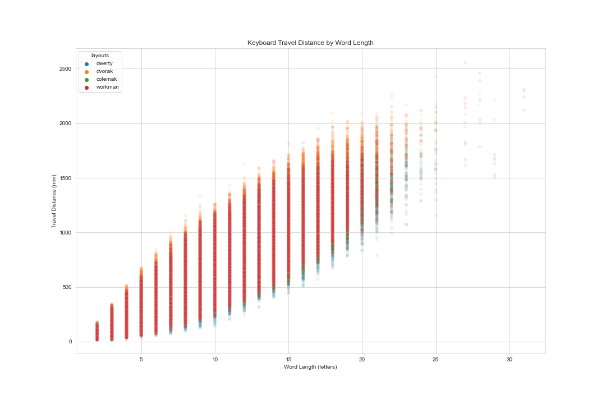
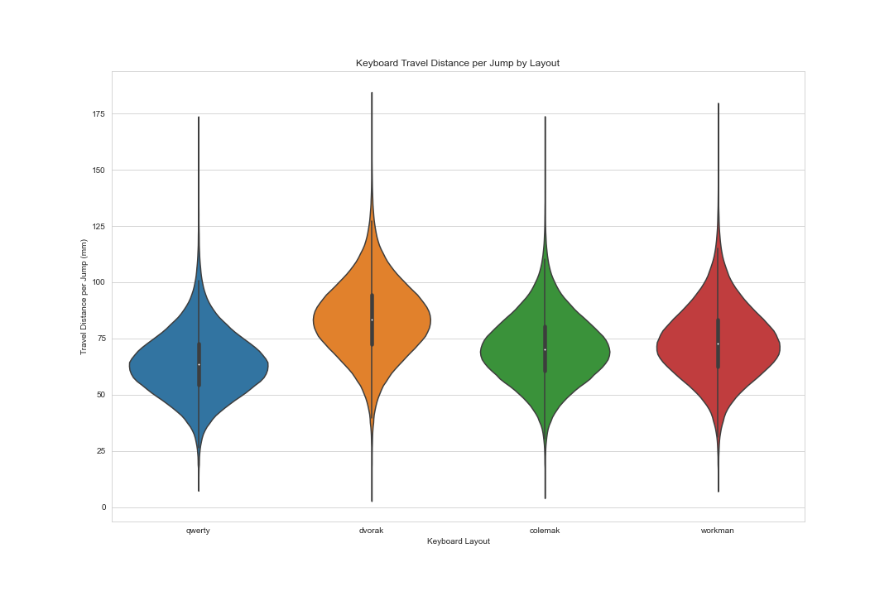
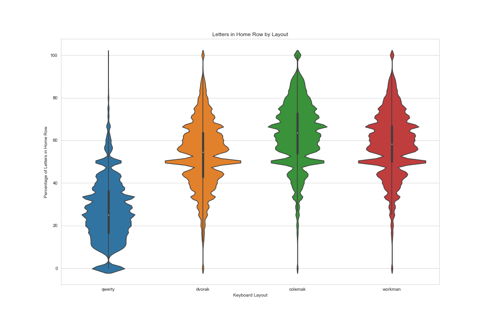

# What is the longest English word?

This started with me watching [this video](https://www.youtube.com/watch?v=Mf2H9WZSIyw&t=562s). If you’re unfamiliar with Matt Parker [Stand-up Maths](https://www.youtube.com/user/standupmaths) on YouTube, I highly recommend his channel. At the very least, watch the video I’ve linked.

TL;DW – bored mathematician calculates keyboard travel distances for ~370,000 words, and presents his findings on the longest, shortest, and pointiest words, and he does everything based on a standard QWERTY keyboard. While watching the video, I wondered what the results would be for a different keyboard layout like Dvorak, as did some commenters (There are dozens of us! Dozens!)

### QWERTY vs Dvorak
With all the key coordinates already calculated by the fantastic Matt Parker, all I had to do was swap out some letters, and 
The longest word on a QWERTY keyboard is DICHLORODIPHENYLTRICHLOROETHANE, with a total travel distance of 2119.49 mm (2.12 meters)
However, the longest word on a Dvorak keyboard is REGENERATORYREGENERATRESS, with a total distance of 2427.09 mm (2.43 meters)
But these words get something of an unfair advantage since they just have so many letters. At this point, Matt calculates the distance per letter for each word, but I think the distance per jump between letters is a more apt measurement.

I'm not sure what kind of "technically a word in scrabble" rules were used to decide what is a word for the purposes of this list, but I'll take a couple liberties and say that "QP" and "PQ" aren't words. That leaves the longest words by distance per jump on a QWERTY keyboard as "PAP", "PAPA", "APA", "PA", and "AP", all with the same 167.77 mm per jump.

On the Dvorak layout, the longest words by distance per jump are "AZ" and "ZA", with a distance of 181.97 mm per jump.

But why stop there? There are also the Colemak and Workman layouts (and probably others but we’re already pretty niche here)

The longest word on a Colemak keyboard is HYDROXYDESOXYCORTICOSTERONE, total distance 2558.52 mm (2.56 meters), and on Workman it's ANTIDISESTABLISHMENTARIANISM, total distance 2390.0 mm (2.39 meters).

If you want to see more results, you can expand the below to see the 20 longest words for each layout as measured by total distance, distance per letter, and distance per jump, as well as the 15 shortest words by total distance from 3 to 10 letters long.
(I’m skipping the pointiest words part because I’m not *that* good at math.)

|Summary stats|QWERTY|Dvorak|Colemak|Workman|
|-------------|------|------|-------|-------|
|Average total distance|540.47|707.08|597.54|622.09|
|Average distance per jump|64.01|83.74|70.77|73.68|
|% of letters in home row|26.49%|53.81%|63.40%|59.00%|

In summary, if you were to type with a single finger, your most efficient option would be QWERTY, with the average word requiring only 540.47 mm of travel, compared to 597.54 mm with Colemak, 622.09 mm with Workman, and 707.08 mm with Dvorak.

Pretty hard to see what’s happening here, but that’s what you get with 1.5 million data points, but we can separate things out and make it more understandable

So with these, it looks like Qwerty is the best layout, but that's only if you type with a single finger, and who types like that? I mean, some people probably do, but most hunt and peck typers I know use at least two fingers. But what about touch typing, how do the layouts compare for that? I calculated the percentage of letters in the home row for each word, for all four layouts, and found that:

QWERTY loses. Badly. With only 26% of typing in the home row. Dvorak is about twice as good, with 54% in the home row, but that still only puts it in third. Workman is in second at 59%, and Colemak wins with 63% of typing done in the home row. Maybe I should consider switching to Colemak...

sources:
word list found [here](https://github.com/dwyl/english-words) (file ‘words_alpha.txt’)
Original QWERTY key coordinates found [here](http://pi-ratebay.com/files/Keyboard_Key_coordinates_%7BPre-Calculated%7D.txt) and adapted for Dvorak, Colemak, and Workman layouts.